# Battleship Game

Welcome to my Battle-Ship game!

(Developer: Daniel Elde-Johansson)

Live site: https://dej-battle-ship-09b38984d0bb.herokuapp.com/

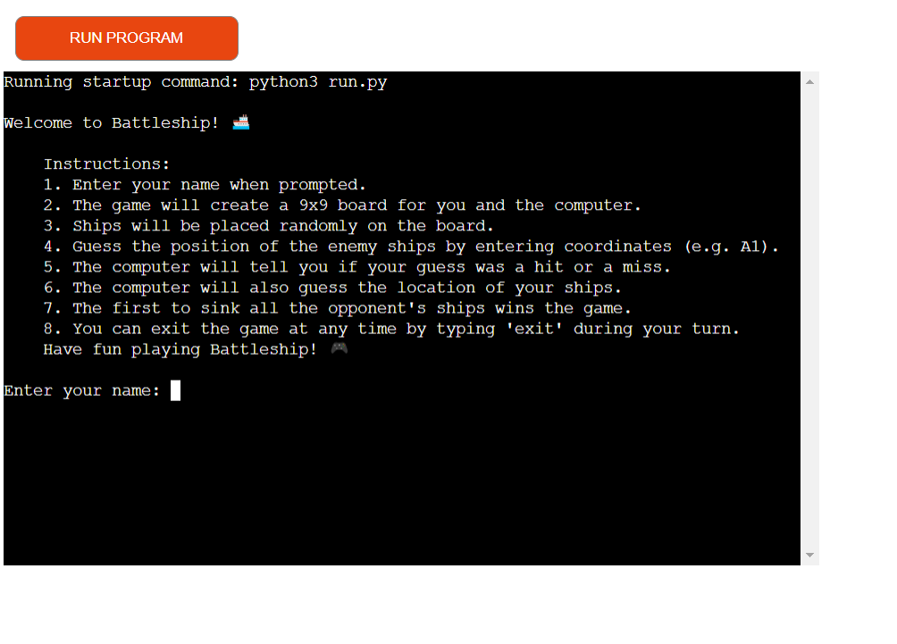

## Table of Content
1. [Introduction](#Introduction) 
2. [Project Goals](#project-goals) 
    1. [User Goals](#user-goals) 
    2. [Site Owner Goals](#site-owner-goals)
3. [User Experience](#user-experience)
    1. [Target Audience](#target-audience)
    2. [User Requirements and Expectations](#user-requirements-and-expectations)
    3. [User Manual](#user-manual)
    4. [Users](#users-)
    5. [Site Owner](#site-owner)
4. [Technical Design](#technical-design)
    1. [Flowchart](#flowchart)    
5. [Technologies](#Technologies)
    1. [Languages](#languages)
    2. [Frameworks & Tools](#frameworks--tools)
6. [Features](#features)
    1. [Main menu](#Main-menu)
    2. [Game hit miss emoji](#Game-hit-miss-emoji)
    3. [Game hit miss text](#Game-hit-miss-text)
    4. [Game Win](#Game-Win)
    5. [Exit](#Exit)
7. [Validation](#validation)
8. [Testing](#testing)
    1. [Manual Testing](#manual-testing)  
9. [Bugs](#Bugs)
10. [Deployment](#deployment) 
    1. [Version Control](#Version-Control)  
    2. [Heroku Deployment](#Heroku-Deployment) 
11. [Acknowledgements](#acknowledgements)              


## Introduction

Welcome to my Battle-ship game, Hope you will enjoy it.


## Project Goals

### User Goals

* Play a fun and easy game. 
* Read the rules of the game.

### Site Owner Goals

* Create a game that is easy and clear to user.
* Ensure that users understand the purpose of the game.
* Create a game that helps user when you make misstake. 

## User Experience

### Target Audience

* People that enjoy classic board games.
* People who like games vs computer.

### User Requirements and Expectations

* A simple  but fun game.
* Personal game with names.
* Easy navigation.

### User Manual

<details><summary>Click here to view instructions</summary>

#### Main Menu

* On the main menu, the user is presented with a welcome message and instructions.

#### Before playing

* Before playing the game you have a set of instructions in a list that you should read.

#### Play

* To start the game you will first have to enter your name.
* When you have entered your name you have to press enter to get to stage 2.
* Then you have to press enter again to start the game.

#### Game

* First thing is that you will see your own board.
* Players take turns to make their moves by writing A-I and 1-9.
* If you hit you will see a fire emoji and if you miss you will see a wave emoji.
* If you shoot a piece that has allready get shot you will get a stop emjoi and a message.
* Make sure you kill all the computers boats before it kills you.

#### Exit game

* If you would like to exit game just type exit game.

</details>

## User Stories

### Users

1. I want to be able to read the rules of the game
2. I want to personalise the game and enter my name
3. I want to receive a real time feedback emoji throughout the game
4. I want to receive a real time feedback message throughout the game
5. I want to get a feedback when I win the game
6. I want the user to exit when he want eaiter to stop or restart game

### Site Owner

1. I want users to easily read the instructions
2. I want users to easily start the game
3. I want users to have a positive experience whilst playing the game
4. I want the game to be vissually fun.

## Technical Design

### Flowchart

The following flowchart summarises the structure and logic of the application.

<details><summary>Flowchart</summary>
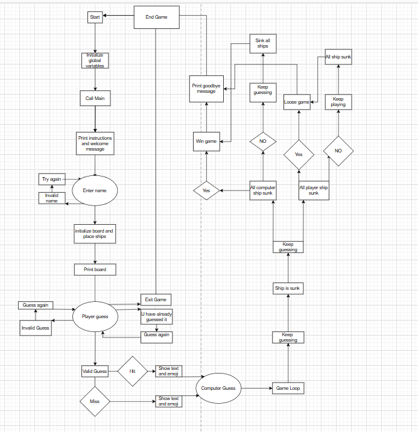
</details>

## Technologies

### Languages

* [Python](https://www.python.org/) programming language for the logic of the program

### Frameworks & Tools

* GitHub
* Gitpod
* Heroku
* pep8ci.herokuapp.com

## Features

### Main menu

* Gives the user a welcome message.
* Gives user option to view game rules or start game.
* Gives the user the option to choose your own name.
* User stories covered: 1, 2

<details>
    <summary>Main Menu Screenshot</summary>

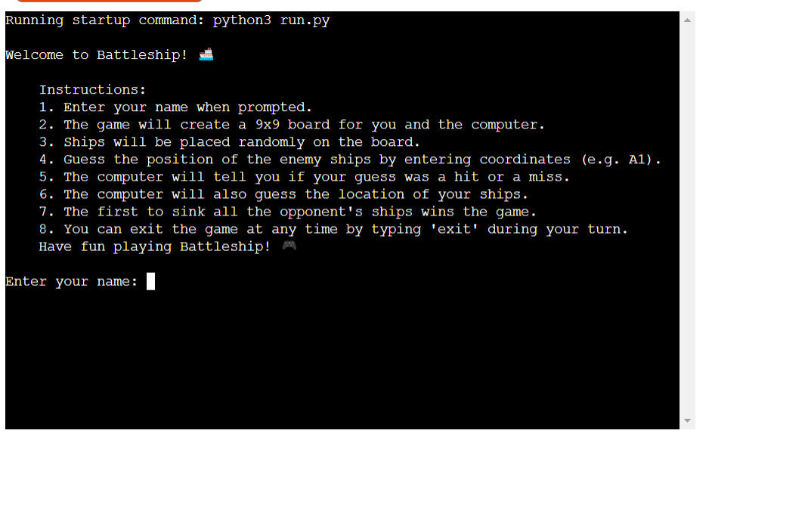
</details>

### Game hit miss emoji

* Will show the user emoji when you get a hit.
* Will show the user emoji when you get a miss.
* User stories covered: 3

<details>
    <summary>Game hit/miss emoji Screenshot</summary>

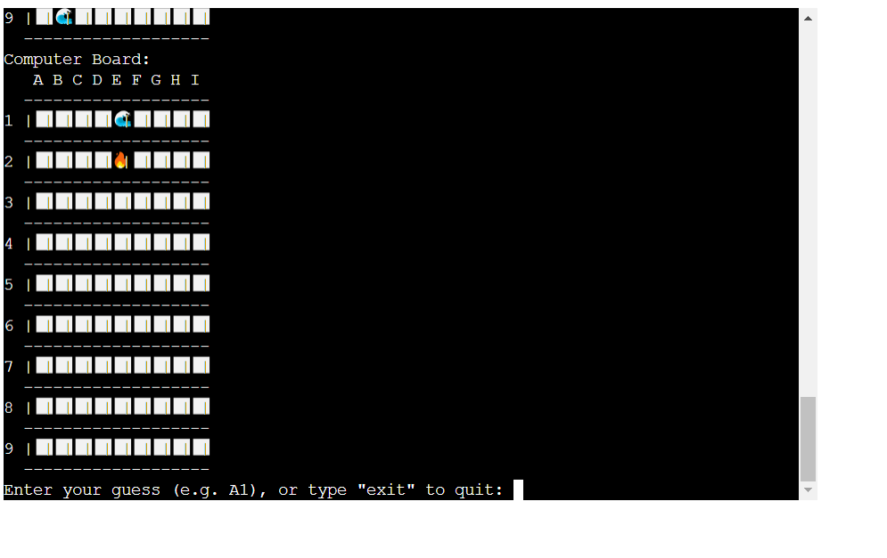
</details>

### Game hit miss text

* Will show the user text  when you get a hit.
* Will show the user text when you get a miss.
* User stories covered: 4


<details>
    <summary>Game hit/miss text Screenshot</summary>

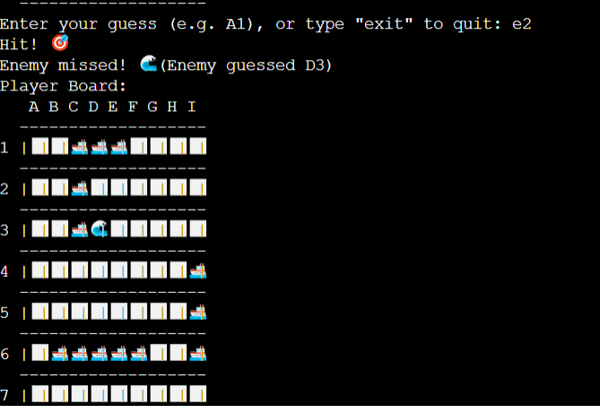
</details>


### Game Win 

* Will show the user when you win
* User stories 5

<details>
    <summary>Game Win Screenshot</summary>

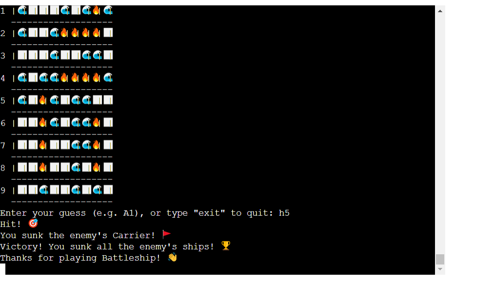
</details>

### Exit

* Will show the user how to exit.
* User stories 6

<details>
    <summary>Exit Game Screenshot</summary>

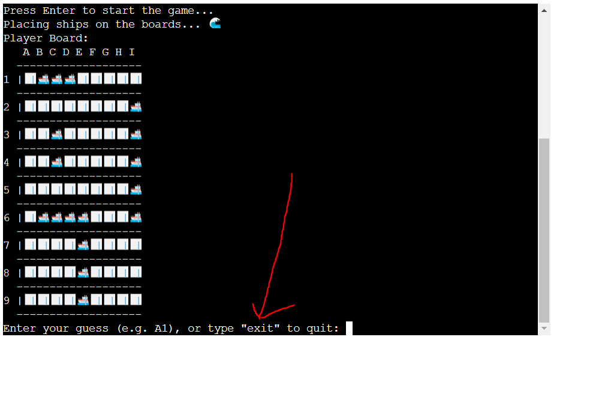
</details>

## Validation

[PEP8 Validation Service](http://pep8online.com/) was used to check the code for PEP8 requirements. All the code passes with no errors and no warnings to show.

<details><summary>PEP3 check for run.py</summary>
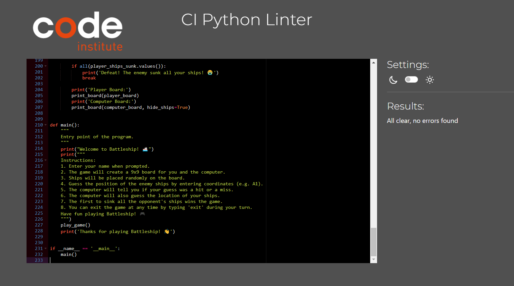
</details>


## Testing

The testing approach is as follows:
1. Manual testing of user stories

### Manual Testing

1. I want to be able to read the rules of the game

| **Feature**   | **Action**                    | **Expected Result**          | **Actual Result** |
| ------------- | ----------------------------- | ---------------------------- | ----------------- |
| Main menu | Main menu | Users are presented with game rules | Works as expected |

<details><summary>Screenshot</summary>
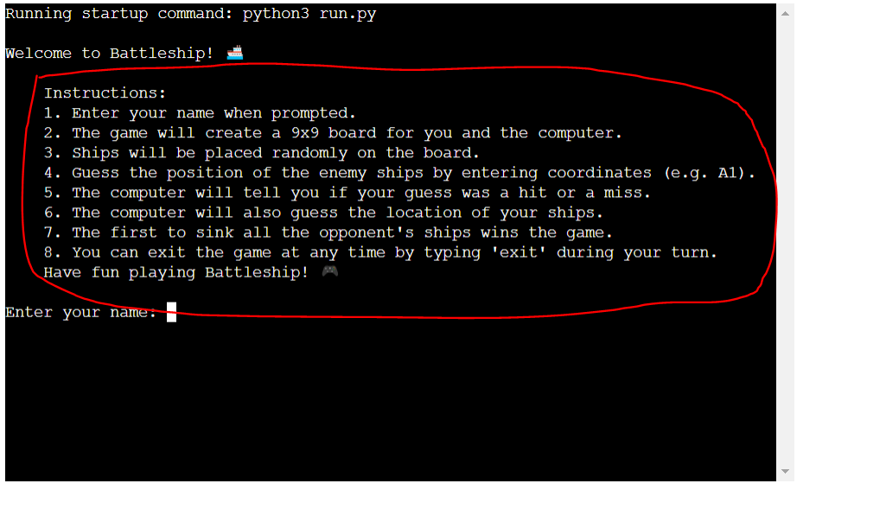
</details>

2. I want to be able to Enter my name

| **Feature**   | **Action**                    | **Expected Result**          | **Actual Result** |
| ------------- | ----------------------------- | ---------------------------- | ----------------- |
| Main menu | Main menu | Users are presented with enter name | Works as expected |

<details><summary>Screenshot</summary>
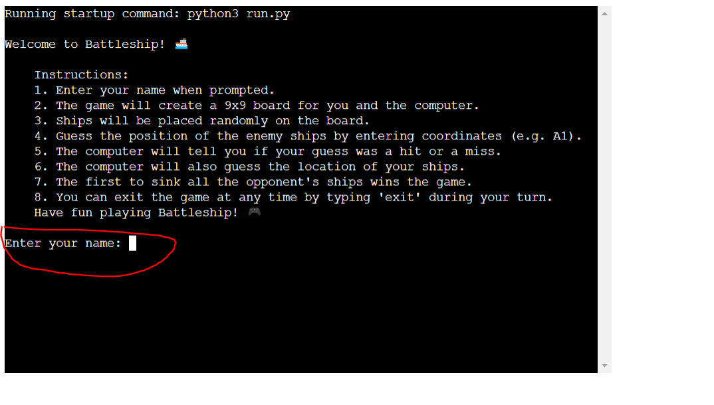
</details>

3. I want to receive a real time feedback emoji throughout the game

| **Feature**   | **Action**                    | **Expected Result**          | **Actual Result** |
| ------------- | ----------------------------- | ---------------------------- | ----------------- |
| Main menu | Game | Users are presented with emoji when hit or miss | Works as expected |

<details><summary>Screenshot</summary>
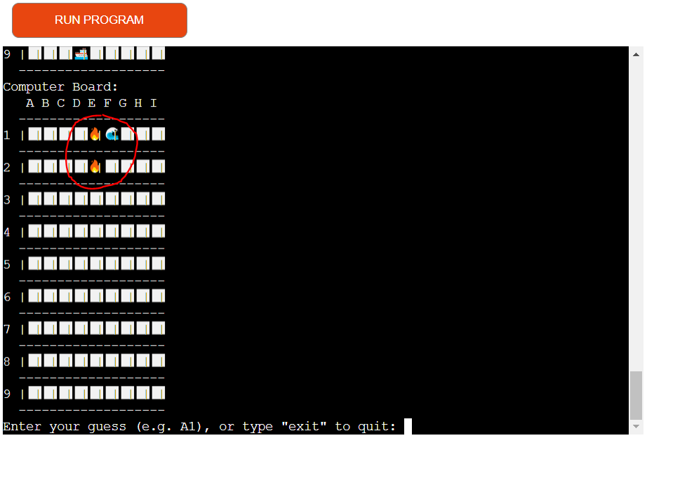
</details>


4. I want to receive a real time feedback text throughout the game

| **Feature**   | **Action**                    | **Expected Result**          | **Actual Result** |
| ------------- | ----------------------------- | ---------------------------- | ----------------- |
| Main menu | Game | Users are presented with text when hit or miss | Works as expected |


<details><summary>Screenshot</summary>
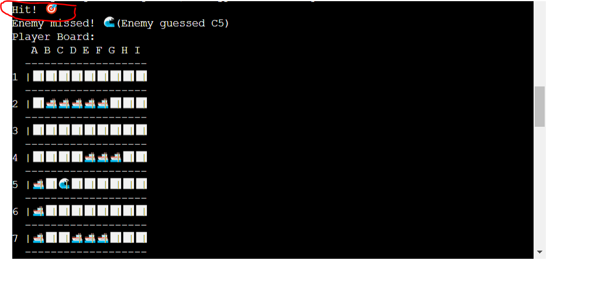
</details>

<details><summary>Screenshot</summary>
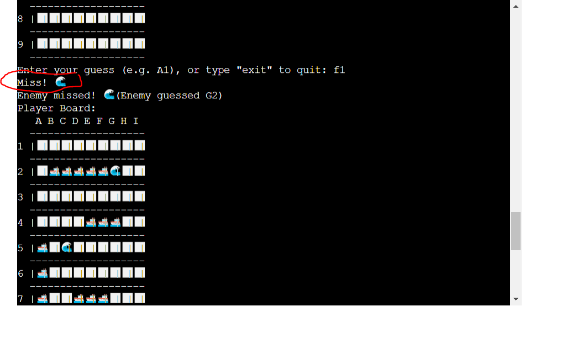
</details>


5. I want to get a feedback when I win the game

| **Feature**   | **Action**                    | **Expected Result**          | **Actual Result** |
| ------------- | ----------------------------- | ---------------------------- | ----------------- |
| Main menu | Game| Users are presented with text when you win game | Works as expected |


<details><summary>Screenshot</summary>
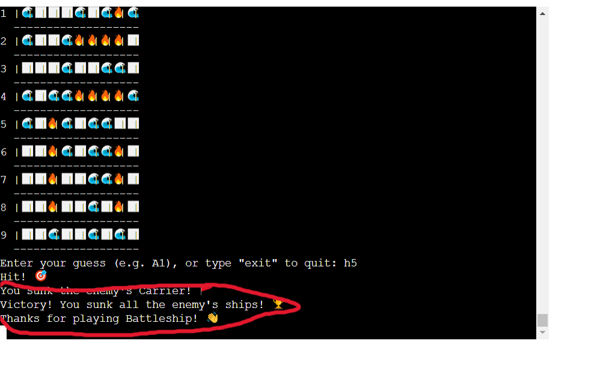
</details>

6. I want the user to exit when he want eaiter to stop or restart game

| **Feature**   | **Action**                    | **Expected Result**          | **Actual Result** |
| ------------- | ----------------------------- | ---------------------------- | ----------------- |
| Main menu | Game| Users have to option at all time to exit game | Works as expected |

<details><summary>Screenshot</summary>
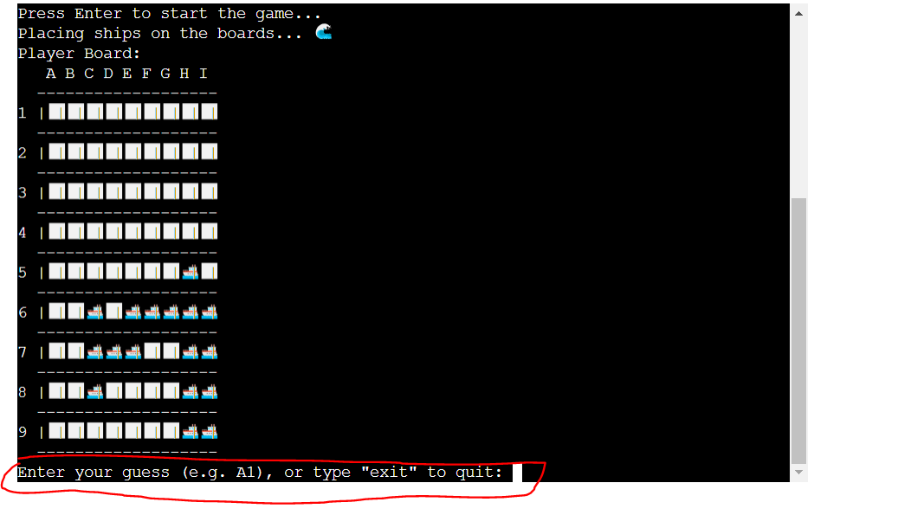
</details>


## Bugs

| **Bug** | **Fix** |
| ------- | ------- |
|I did not manage to get Git hub and Heroku to work togheter|Had to create a whole new account with same email on both|
|Did not get the emojis to work propperly| Had to put them all togheter like this 'X': '🔥'| 


## Deployment

### Version Control

The site was created using the Visual Studio Code editor and pushed to github to the remote repository Battleship_PP3_CI

The following git commands were used throughout development to push code to the remote repo:

- ```git add .``` - This command was used to add the file(s) to the staging area before they are committed.
- ```git commit -m "commit message"``` - This command was used to commit changes to the local repository queue ready for the final step.
- ```git push``` - This command was used to push all committed code to the remote repository on github.

### Heroku Deployment

The below steps were followed to deploy this project to Heroku:
- Go to Heroku and click "New" to create a new app.

- Choose an app name and region region, click "Create app".
- Navigate to Buildpacks and add buildpacks for Python and NodeJS (in that order).
- Navigate to "Deploy". Set the deployment method to Github and enter repository name and connect.
- Scroll down to Manual Deploy, select "main" branch and click "Deploy Branch".
- The app will now be deployed to heroku

## Acknowledgements

I would like to take the opportunity to thank:
* My mentor Mo Shami for his feedback, advice, and support.
* My Wife Agnes for her support, advice and help with the baby so i can take time for my project.